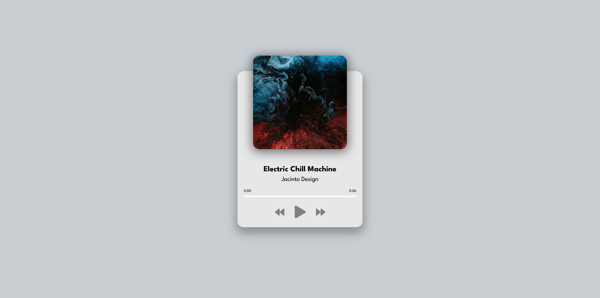

# Music Player

This project showcases an interactive and responsive music player application, built as part of the course "JavaScript Web Projects: 20 Projects to Build Your Portfolio" by Zero To Mastery. The player allows users to play, pause, skip tracks, and view real-time progress, all with a clean and modern design.

## Table of contents

- [Music Player](#music-player)
  - [Table of contents](#table-of-contents)
  - [Overview](#overview)
    - [Screenshot](#screenshot)
    - [Links](#links)
  - [My process](#my-process)
    - [Built with](#built-with)
    - [What I learned](#what-i-learned)
    - [Useful resources](#useful-resources)
  - [Author](#author)
  - [Acknowledgments](#acknowledgments)

## Overview

This project includes the following features:
- Play, pause, and navigate between tracks with a user-friendly interface.
- Real-time progress bar updates as the music plays.
- Dynamic display of song title, artist, and album art.
- Smooth transitions and animations for better user experience.

### Screenshot



### Links

- Live Site URL: [DT Code](https://music-player.dtcode.se/)

## My process

### Built with

- HTML5 for semantic structure.
- CSS3 for responsive styling.
  - Custom properties (CSS variables).
  - Flexbox for layout.
- JavaScript (ES6+) for interactivity.
  - DOM manipulation.
  - Event handling.
  - Dynamic updates to the UI.

### What I learned

In this project, I learned:
- How to manage audio playback in JavaScript using the audio element and its properties (play(), pause(), currentTime, duration).
- How to create and update a dynamic progress bar based on real-time playback.
- Implementing click events on a progress bar to allow users to navigate through the track.
- Efficient use of arrays and objects to manage song data and dynamically update the DOM.

Example code for handling progress bar updates:

```js
function updateProgressBar(e) {
    if (isPlaying) {
        const { duration, currentTime } = e.srcElement;
        // Update progress bar width based on current playback time
        const progressPercent = (currentTime / duration) * 100;
        progress.style.width = `${progressPercent}%`;

        // Calculate and display current time and duration
        const currentMinutes = Math.floor(currentTime / 60);
        const currentSeconds = Math.floor(currentTime % 60).toString().padStart(2, '0');
        const durationMinutes = Math.floor(duration / 60);
        const durationSeconds = Math.floor(duration % 60).toString().padStart(2, '0');
        currentTimeEl.textContent = `${currentMinutes}:${currentSeconds}`;
        durationEl.textContent = `${durationMinutes}:${durationSeconds}`;
    }
}
```

### Useful resources

- [MDN Web Docs: HTML Audio/Video API](https://developer.mozilla.org/en-US/docs/Web/API/HTMLMediaElement) - Helped in understanding audio element properties and methods.
- [Font Awesome](https://fontawesome.com/) - Utilized to enhance the visual appearance of music player controls.
- [Unsplash](https://unsplash.com/) - Provided high-quality album art images.

## Author

- GitHub - [@dantvi](https://github.com/dantvi)
- LinkedIn - [@danieltving](https://www.linkedin.com/in/danieltving/)

## Acknowledgments

Special thanks to Zero To Mastery for creating this hands-on course. The project provided valuable insights into building interactive web applications. Additional thanks to MDN Web Docs for their extensive and helpful documentation.
